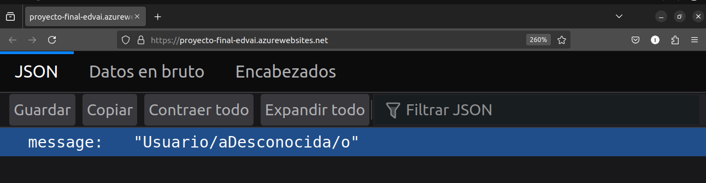
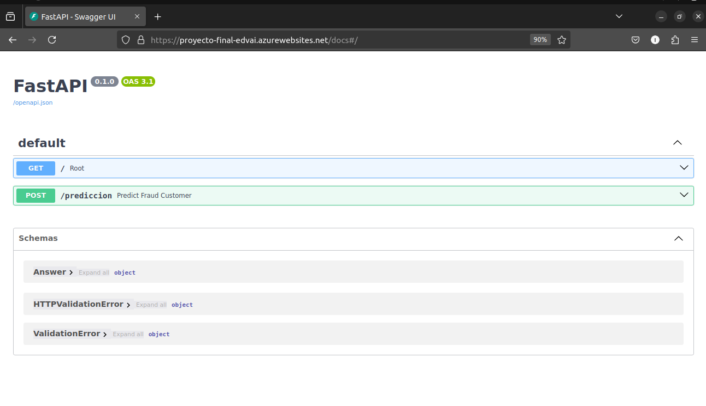

# Final Project - Fraud Detection and Prevention Model
## Project Description
### <u>Objective</u>
In this project, I am going to build a classification model with Random Forest in order to detect and prevent fraud. The data I am going to use to train the model came from fictional clients of an E-commerce company.  
_<u>The input data that will be passed to the model in order to make predictions are:</u>_
- `orderAmount`: Float
- `orderState`: String
- `paymentMethodRegistrationFailure`: String
- `paymentMethodType`: String
- `paymentMethodProvider`: String
- `paymentMethodIssuer`: String
- `transactionAmount`: Integer
- `transactionFailed`: Boolean
- `emailDomain`: String
- `emailProvider`: String
- `customerIPAddressSimplified`: String
- `sameCity`: String  

_<u>And the model is going to return one of the following predictions:</u>_
- __No__
- __Sí__
- __Warning__
### <u>Process</u>
We are going to receive a dataset in JSON format, which we need to __transform__ into a CSV format. After performing this transformation, we can observe certain columns that should be deleted or manipulated. For example, we should remove the IDs , and for the  `CustomerEmail` column, we need to keep the most important/common values and classify rare values under a new label called _"weird"_.  

After this data adaptation and manipulation process, we proceed with an __Exploratory Data Analysis (EDA)__, where we conduct univariate analysis, bivariate analysis and correlations for specific variables that stood out to us. Once the EDA was done, I highlighted specific insights I found.
 
After completing the EDA, we __prepare the data__ by discretizing variables, handling missing values, and interpretating and modifying certain variables.

Before training, we select specific columns from the post-processed dataset, and normalize their values. During training, we are going to train two __Clustering__ models with two different algorithms: One model will use the __K-Means__ algorithm while the other one will use __HDBSCAN__. Once trained, we document the insights discovered through a coordinate plot for each model. 

To finalize with the modeling process, we will create a __classification model with Random Forest__. Once the model was trained with specific parameters, we generate a confusion matrix in order to observe the number of correct and incorrect predictions made by the model, organized by class.

Moving on to the __API´s development__, we create an API that receives specific input data, it transforms them (discretization, one hot encoding), and returns the prediction made by model based on that input. Then we containerize the API using Docker. Finally, we host it on Microsoft Azure.

Finally, we create with Gradio a __Graphical User Interface__ and we deploy it in Hugging Face Spaces. The URL to test the interactive app is: https://huggingface.co/spaces/Itrs/Proyecto_Final

## Methods Used
- Data Cleaning and Transformation (Data Wrangling)
- Exploratory Data Analysis (EDA)
- Data Visualization
- Data Preparation
- Model Training (Clustering and Classification)
- Model Evaluation
- Model Deployment with an API, Docker y Microsoft Azure
- Graphical User Interface with Gradio

## Technologies and Tools used
### <ins>1. Cleaning, Transformation and Data Preparation </ins> 
- **Pandas**: Load and prepare data, efficiently manipulate datasets, transform a dataset from JSON format to CSV format, perform descriptive analysis.

### <ins>2. Data Visualization / EDA</ins>
- **Funpymodeling**: Observe data distribution, the number of unique values and their occurrences, standard deviation, percentage of missing values, correlation between variables, among other information.
- **Seaborn y Matplotlib**:  Tools for data visualization and creation of statistical plots (Correlation, scatter plots, confusion matrix).
- **Minepy (MINE)**:  Identify non-linear and complex relationships between variables in datasets using the algorithm MINE (Maximal Information-based Nonparametric Exploration).
- **YellowBrick (Cluster.KelbowVisualizer)**: Visualization of the Elbow Method in clustering algorithms.
- **Plotly (Scatter3D)**: Visualization of Interactive 3d Scatter Plots for clusters.

### <ins>3. Modeling</ins>
- **Hdbscan**: HDBSCAN algorithm (Clustering Model).
- **Scikit-Learn**
    - **KMeans**: K-Means algorithm (Clustering Model).
    - **RandomForestClassifier**: Random Forest algorithm (Classification Model).
    - **ConfusionMatrixDisplay**: Visualize Confusion Matrix (Classification Model).
- **Mlflow**: Management and registration of model experiments, allowing us to track parameters, metrics and versions.

### <ins>4. API</ins>
- **FastAPI**: API creation in order to expose the trained model.
- **Uvicorn**: Light and fast ASGI server that allows the asyncronous execution of the API.
- **Requests**: Make HTTP requests to the API.
- **Pydantic**: Validate the input data of the API.
- **Gradio**: Graphical User Interface that allows the users to test the model.

### <ins>5. Deployment</ins> 
- **Docker**: Containerize the API and simplify its deployment.
- **Hugging Face Space**: Host and share the model  in a centralized way.
- **Microsoft Azure**: Deployment platform in order to host the API.

### <ins>Programming Language</ins>
- **Python**: Main language used for the development of the project, compatible with the libraries of data science and machine learning.

## Installation
### Docker
1. Build image:  
`docker build -t proyecto_final .`

2. Build container:  
`docker run -p 7860:7860 -e ID_USER=Iñaki proyecto_final` 

## Deploy Docker Hub + Web App in Microsoft Azure 

## To keep in mind
- If we want to run `mlflow ui`, we must be inside the __deployment/__ folder, which is where the __mlruns/__ folder is located.
- The insights made in the notebooks are in Spanish.
